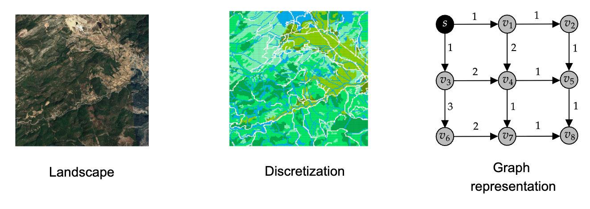
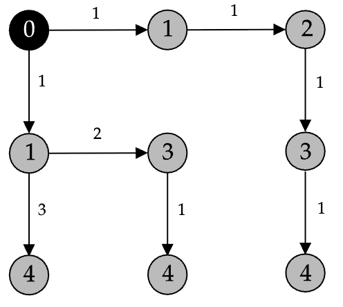
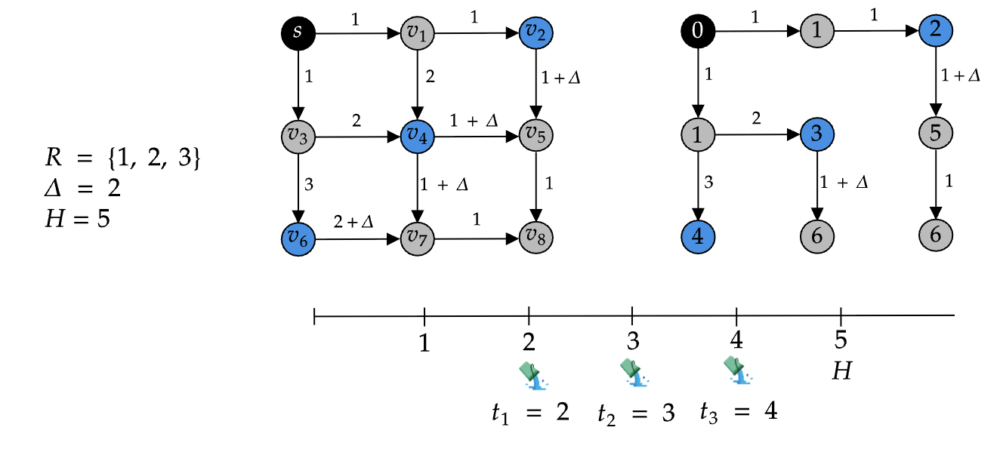

# Wildfire Suppression

This repository contains all the source code and data related to my Master's thesis, which is available [here](). Section 1 describes the problem I tackled, and Section 2 explains how to compile the codebase. The next three sections then show how to generate an instance for the problem (Section 3), how to solve the instance using one of the available algorithms (Section 4), and how to visualize the obtained solution (Section 5). The last section lists the publications related to the thesis.

Contents:
1. [The problem](#problem)
2. [Compiling the code](#compilation)
2. [Generating an instance](#instances)
3. [Running an algorithm](#execution)
4. [Visualizing a solution](#visualizing)
5. [How to cite](#citing)

## 1. The problem <a name="problem"></a>

My work tackles a combinatorial optimization coming from the context of decision support systems for wildfire suppression. We are given a graph $G=(V,A)$ encoding a discretized landscape, where each vertex $v \in V$ represents a cell of the landscape and arcs $uv \in A$ hold the time taken by a fire to propagate from cell $u$ to cell $v$. Such times can be estimated by using local spread conditions (e.g. vegetation, slope, wind, temperature) and a fire propagation model like [Rothermel's](https://www.fs.usda.gov/rm/pubs_series/rmrs/gtr/rmrs_gtr371.pdf). The figure below shows an example of a landscape (left), its discretization into a grid of cells (middle), and the associated directed graph (right). In the example, the associated graph does not really represent the landscape on the left, and the fire travel times are fictitious. In practice, the graph will have way more vertices, ideally once per cell. The first two figures are from [this article](https://www.sciencedirect.com/science/article/pii/S0377221724001796). 

<center>
 
</center>

Given a vertex $s \in V$ representing an ignition, we can approximate fire spread dynamics over the original landscape by computing the shortest-path tree rooted at the ignition vertex. There is [literature](https://cdnsciencepub.com/doi/10.1139/x02-068) arguing that, if the fire propagation times on the arcs are well estimated, then the shortest-path tree provides a good approximation of the real dynamics. If we take vertex $s$ as the ignition in the example above, and we assume it burns at time $0$, then we obtain the following shortest-path tree. Notice that the figure shows the fire arrival time at each vertex. 

<center>
 
</center>

Now suppose we have a set $R$ of firefighting resources, such as helicopters or a crew of [smokejumpers](https://en.wikipedia.org/wiki/Smokejumper). Each resource $i \in R$ can be allocated to a vertex $v \in V$, to introduce a delay $\Delta$ on the outgoing arcs of vertex $v$. You can think of allocating a resource to a vertex as dropping water over the cell represented by the vertex, or razing its flammable content. The delay $\Delta$ introduced by a resource will cause a local slowdown in fire propagation, and we hope that the fire arrival time at some vertices will increase. The figure below shows an example where we have three resources available and the delay $\Delta$ is 2. In the figure, the resources are allocated to vertices $v_2$, $v_4$, and $v_6$. Notice how the graph is updated with the delays $\Delta$. The figure on the right depicts the new shortest-path tree. Notice how the fire arrival time at vertices $v_5$, $v_7$, and $v_8$ increased two time units each. 

<center>
 
</center>

Each fire suppression resource $i \in R$ has an associated release time $t_i$, and you can think of the release time of a resource as the time it is first available to be deployed. In the case of a fire crew, for example, $t_i$ could represent the time necessary to transport the firefighters from the base to the fire location. We assume that a resource released at time $t_i$ can only be allocated to a vertex $v$ if the fire did not reach $v$ by time $t_i$. In the figure above, the timeline shows that we have one resource released at time 2, one at time 3, and one at time 4. Notice that vertices $v_1$ and $v_3$ cannot receive resources, because they both burn at time 1 and the first resource is available at time 2.

Given a planning horizon $H$, such as 24 hours, the goal is to find an allocation of the suppression resources to the vertices of the graph such that the number of vertices reachable by the fire within the horizon $H$ is minimized. In practice, we are trying to find a suppression strategy that minimizes the burned area within the planning horizon $H$. In the example above, if $H=5$, then the allocation of resource saves vertices $v_5$, $v_7$, and $v_8$ from burning.

If you want to get a feeling of what fighting wildfires looks like, I recommend [this video](https://www.youtube.com/watch?v=EodxubsO8EI&ab_channel=WendoverProductions). 

## 2. Compiling the code <a name="compilation"></a>

To compile this codebase, you'll need:
- CMake 3.5 or higher
- Boost 1.7 or higher
- Gurobi 10.0.3 or higher  
- A compiler that supports C++20

Once everything is in place, type the following in your terminal from the root of this repository:
```bash
cmake -B build -S . -D CMAKE_BUILD_TYPE=Release
cmake --build build
```

## 3. Generating an instance <a name="instances"></a>

The folder ```scripts``` contains some useful python scripts, which depend on the packages listed in ```environment.yml```.  If you have [Miniconda](https://www.anaconda.com/docs/getting-started/miniconda/install#linux) installed, type the following in your terminal from the root of this repository: 

```bash
conda env create -f environment.yml
conda activate wildfire
```

Instances to the problem are generated by the script ```instance_generation.py```, which implements the instance model described in my thesis. To generate a 30x30 grid with light wind and moderate slope, for example, type the following:

```bash
python3 scripts/instance_generation.py --grid Medium --wind Light --slope Moderate --seed 10 --save_as_gif
```

If everything went fine, a JSON file describing the instance should have been created. The flag ```--save_as_gif``` generates a GIF illustrating how fire propagates through the grid.

<center>
 
</center>


## 4. Running an algorithm <a name="execution"></a>

Four algorithms are implemented in ```src/algorithm```, namely
- Iterated Beam Search (```ibs```)
- Mixed-integer Programming (```mip```)
- Cut-based Heuristic (```cuth```)
- Random Search (```rs```)

If the codebase was compiled correctly in Section 2, you can run beam search on the instance generated in the last section as follows:
```bash
./build/fire --alg ibs --instance Medium_Moderate_Light_High_Moderate_Moderate_Early_VeryLate_10.json --seed 1 --timelimit 300 --save_solution --output stats.csv
```

After 300 seconds, a file ```stats.csv``` should have been created with statistics about the execution, such as the objective value of the best found solution, the number of completed iterations, etc. The format of the output depends on the algorithm, and we encourage the user to check the method ```Algorithm::write_statistics()``` (which is implemented by all algorithms) for more information. 

The flag ```--save_solution``` generates a JSON file describing the best solution found by the algorithm during the 300 seconds of execution. This file is named as ```sol_${instance_name}_${seed}.json```, where ```${instance_name}``` is the name of the instance and ```${seed}``` is the seed value used by the algorithm. In the example above, ```${instance_name} = Medium_Moderate_Light_High_Moderate_Moderate_Early_VeryLate_10``` and ```${seed} = 1```. 

We will see how to visualize solutions in the next section.

## 5. Visualizing a solution <a name="visualization"></a>

The script ```visualize_solution.py``` creates visualizations of a solution. It takes as input an instance and the JSON file generated by the flag ```save_solution```. 

There are two visualization modes. The static mode depicts the state of the grid at the optimization horizon. The ignition cell is depicted in red, burned cells are painted in orange, protected cells in black, and saved cells in white. Run the following line in your terminal to create a static visualization of the solution produced in the last section.

```bash
python3 scripts/visualize_solution.py --instance_path Small_Moderate_Light_High_Moderate_Moderate_Early_VeryLate_10.json --solution_path sol_ibs_Small_Moderate_Light_High_Moderate_Moderate_Early_VeryLate_10_1.json --mode static
```

The figure below illustrates the best solution found by beam search within 300 seconds. 

<center>
 
</center>

The script also supports a dynamic visualization mode, in which the grid is represented in three-dimensional space and a slider allows you to move forward/backward in time. To run a dynamic visualization, type the following:

```bash
python3 scripts/visualize_solution.py --instance_path Small_Moderate_Light_High_Moderate_Moderate_Early_VeryLate_10.json --solution_path sol_ibs_Small_Moderate_Light_High_Moderate_Moderate_Early_VeryLate_10_1.json --mode dynamic
```

The GIF below illustrates the visualization. At any time point, the ignition cell is painted in black, cells reached by the fire are painted in red, protected cells are painted in blue, and the remaining cells are painted in red.

<center>
 <video src='assets/sol_ibs_Medium_Moderate_Light_High_Moderate_Moderate_Early_VeryLate_10_1.mp4' width='50%' />
</center>

## 6. How to cite <a name="citing"></a>

If you use code or ideas from this repository, please cite the relevant paper(s):

- **Delazeri, G. & Ritt, M. (2024).** *Iterated Beam Search for Wildland Fire Suppression.*  
  In S. Smith, J. Correia & C. Cintrano (Eds.), **Applications of Evolutionary Computation** (pp. 273–286). Cham: Springer Nature Switzerland. ISBN 978-3-031-56852-7.

- **Delazeri, G. & Ritt, M. (2024).** *A General Model for Wildfire Suppression Problems.*  
  In **Anais do Simpósio Brasileiro de Pesquisa Operacional** (SBPO 2024, Vol. 56). Galoa. DOI [10.59254/sbpo-2024-193493](http://dx.doi.org/10.59254/sbpo-2024-193493). ISSN 2965-1476.
